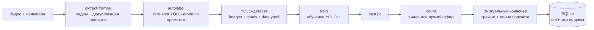

# conveyor-counter

Сервис подсчёта деталей на конвейере: zero-shot разметка кадров, обучение YOLO11
и подсчёт деталей через виртуальную модель ленты. Конвейер движется **справа налево**.

## Архитектура



### 1. Zero-shot разметка (`extract-frames` + `autolabel`)

* Из видео берётся каждый N-й кадр; почти не изменившиеся кадры (пролаги,
  зависания трансляции) отбрасываются по среднему попиксельному отличию.
* Кадры размечаются моделью **YOLO-World** (открытый словарь) по текстовым
  промптам из конфига — обучение не требуется. Для детали с фото подходят
  промпты вида `"stamped sheet metal panel"`.
* Результат — датасет в формате YOLO (train/val + `data.yaml`). Флаг
  `--preview` сохраняет картинки с рамками для визуальной проверки разметки.

### 2. Обучение YOLO11 (`train`)

Обычное обучение `yolo11n/s/m/...` на собранном датасете. Сервис мультиклассовый:
чтобы различать новые детали, достаточно добавить класс с промптами в конфиг,
доразметить кадры с новой деталью и переобучить модель.

### 3. Подсчёт через виртуальный конвейер (`count`)

Детекции YOLO11 **не считаются напрямую** — они питают виртуальную модель ленты
(`src/conveyor_counter/counting/virtual_conveyor.py`):

* **Спавн справа.** Экземпляр детали создаётся только когда детекция появляется
  в зоне спавна (`spawn_zone_x`). Одиночные детекции в середине ленты —
  пролаги/призраки YOLO — игнорируются.
* **Движение только влево.** Детекция сопоставляется с экземпляром, только если
  она не правее его текущей позиции (плюс маленький допуск на дрожание).
  Если YOLO «откатывается» и видит деталь правее (классический пролаг),
  такая детекция экземпляр не двигает и новый не создаёт.
* **Накат при пропусках.** Если YOLO молчит, экземпляр продолжает ехать влево
  со своей оценённой скоростью (EMA по наблюдаемым смещениям), поэтому короткие
  пропуски детекций не ломают подсчёт.
* **Линия подсчёта.** При пересечении `count_line_x` счётчик класса за текущий
  день увеличивается на 1, экземпляр исчезает с виртуальной ленты, и дальнейшие
  детекции левее линии ни на что не влияют — «внимание» переходит к следующей
  детали, которая появится справа.
* **Брак.** Если деталь пропала из детекций надолго до линии
  (`max_missed_frames`) или докатилась до линии «вслепую» слишком поздно
  (`max_coast_frames`) — её убрали с ленты, экземпляр удаляется **без** подсчёта.

Счётчики `день x класс` и журнал событий хранятся в SQLite (`data/counts.sqlite3`).

## Установка

```bash
python3 -m venv .venv && source .venv/bin/activate
pip install -e ".[dev]"
```

## Использование

```bash
# 1. Кадры из видео с конвейером
conveyor-counter extract-frames --video conveyor.mp4 --out data/frames

# 2. Zero-shot разметка и сборка датасета (с превью для проверки)
conveyor-counter autolabel --frames data/frames --out data/dataset --preview

# 3. Обучение YOLO11
conveyor-counter train --data data/dataset/data.yaml

# 4а. Подсчёт по записанному видео (с сохранением аннотированного ролика)
conveyor-counter count --source conveyor.mp4 \
    --weights runs/conveyor_yolo11/weights/best.pt --save out.mp4

# 4б. Прямой эфир: камера или RTSP-поток
conveyor-counter count --source 0 --weights best.pt --show
conveyor-counter count --source rtsp://host/stream --weights best.pt

# 5. Отчёт по счётчикам
conveyor-counter report                # все дни
conveyor-counter report --day 2026-06-11
```

Все команды принимают `--config путь.yaml`; по умолчанию — `configs/default.yaml`.

## Конфигурация

Ключевые параметры в `configs/default.yaml`:

| Параметр | Смысл |
|---|---|
| `classes.<имя>.prompts` | текстовые промпты zero-shot разметки для класса детали |
| `conveyor.spawn_zone_x` | правая зона, где появляются новые детали (доля ширины кадра) |
| `conveyor.count_line_x` | линия подсчёта слева |
| `conveyor.right_tolerance` | допуск дрожания вправо; правее — детекция считается пролагом |
| `conveyor.max_missed_frames` | сколько кадров ждать пропавшую деталь до признания браком |
| `conveyor.max_coast_frames` | макс. «слепой» накат до линии, при котором деталь ещё засчитывается |
| `counting.db_path` | путь к SQLite-базе счётчиков |

### Добавление новой детали

1. Добавить класс в `classes` с промптами под новую деталь.
2. Прогнать `extract-frames` + `autolabel` по видео с новой деталью
   (кадры можно класть в общий каталог — датасет станет мультиклассовым).
3. Переобучить: `conveyor-counter train ...`.
4. Подсчёт автоматически ведётся раздельно по классам.

## Тесты

Логика виртуального конвейера — чистый Python без torch/cv2, покрыта тестами
(пролаги YOLO, пропуски детекций, брак, две детали подряд и т.д.):

```bash
pip install pytest pyyaml
python3 -m pytest tests/ -v
```

## Структура проекта

```
configs/default.yaml                      — конфигурация (классы, конвейер, обучение)
src/conveyor_counter/
  cli.py                                  — CLI (extract-frames / autolabel / train / count / report)
  config.py                               — загрузка YAML-конфига
  autolabel/frames.py                     — извлечение кадров с дедупликацией пролагов
  autolabel/zero_shot.py                  — zero-shot разметка YOLO-World, сборка датасета
  training/train.py                       — обучение YOLO11
  counting/virtual_conveyor.py            — виртуальная модель ленты (ядро логики подсчёта)
  counting/service.py                     — цикл видео -> YOLO11 -> конвейер -> счётчики, визуализация
  counting/store.py                       — SQLite-хранилище счётчиков по дням и журнала событий
tests/                                    — тесты логики конвейера и хранилища
```
